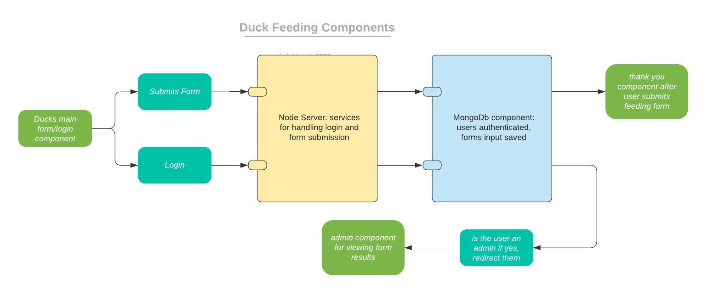
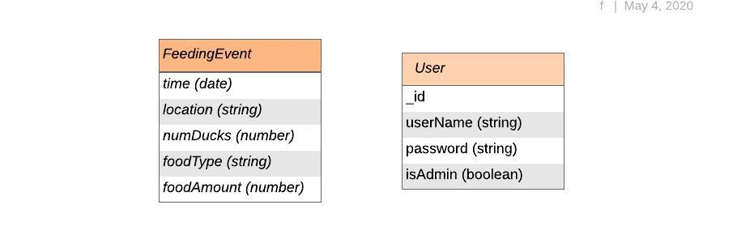

# [Duck Assignment](https://duckclient01.herokuapp.com/)
## Approach
My initial ideas about this assignment were focused on providing the researcher with valuable data by having the user submission form easy to use. The requirements left it quite open on how this data was supposed to be presented, and I ended up displaying it in a table due to the time constraints. 

I started with the backend hooked it up to a database running on _MongoDB Atlas_. I tested it initially through the VSCode Rest extension, intending to implement some proper tests through Jest later.

When I started the frontend I was determined to get a _Google Maps_ autocomplete field implemented, as this would make it easy for a user to provide exact locations of where they were feeding the ducks. Unfortunately, I ended up wasting hours trying to get the API working, and ended up abandoning this idea in favor of a text input. This caused the rest of the frontend work for me to be rushed and disorganized, and I did not have time to add testing. 

The researcher can view the data in a simple table by logging into the app with the username 'admin' and the password 'admin'.

## Technology 
The stack I chose to use for this assigment included:

- _Node.js_ and _Express_- simply because I'm familiar with this stack.
- For the database I went with _MongoDB_. Mainly because the model for a duck feeding event didn't seem too complex, so seemed okay to use a document-oriented database, There was also no indication that the researcher would be performing a lot of document updates.
- _React_ for the frontend - also just because it's familiar.

## Components

## Database Model

